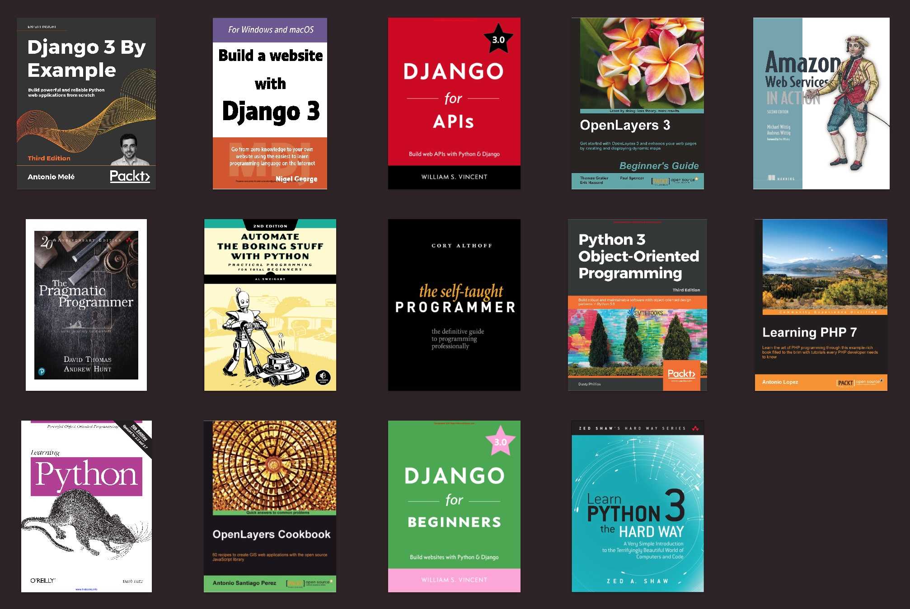

# 👋 Hi there, I'm Aleksandar - aka AlexRabbit 🐰

#### *"There are 10 types of people in the world. Those who understand binary and those who don't." — Neo*
## 🔗 Connect

  
  <!--&nbsp;&nbsp;-->
  &nbsp;&nbsp;
  &nbsp;&nbsp;
  

## 📝 About Me

- 🔭 I just launched my first course: [Become A VS Code SuperHero!][course]!
- 🌱 I’m currently learning everything 🤣
- 👯 I’m looking to collaborate with other content creators
- 🥅 2020 Goals: Contribute more to Open Source projects
- ⚡ Fun fact: I love to draw and play guitar / drums
- Results-oriented, Technology professional with proven leadership ability; capable of keeping a team focused on day-to-day tasks and long-term deadlines.
- Ambitious, highly motivated and able to face challenging work and deliver quality output while meeting deadlines. 

<h2>💻 Languages and Tools</h2>

<!-- 

 -->

---
## 📚 Books That I Read

 

💵 You can buy it here: ⤵️

* Django 3 By Example: 
https://www.amazon.com/Django-Example-powerful-reliable-applications/dp/1838981950/ref=sr_1_1?crid=1PGCEWRZY5A4C&dchild=1&keywords=django+3+by+example&qid=1613430409&sprefix=django+3%2Caps%2C258&sr=8-1
* Build a Website With Django 3:
https://www.amazon.com/Build-Website-Django-Nigel-George/dp/0648884406/ref=sr_1_1?dchild=1&keywords=build+a+website+with+django&qid=1613430540&sr=8-1
* Django for APIs: https://www.amazon.com/Django-APIs-Build-web-Python/dp/1735467227/ref=sr_1_1?dchild=1&keywords=django+for+apis&qid=1613430798&sr=8-1
* OpenLayers 3: https://www.packtpub.com/product/openlayers-3-beginner-s-guide/9781782162360
* Amazon Web Services in Action 2nd Edition: https://www.amazon.com/Amazon-Services-Action-Andreas-Wittig/dp/1617295116/ref=sr_1_4?dchild=1&keywords=amazon+web+services&qid=1613430987&sr=8-4
* The Pragmatic Programmer: https://www.amazon.com/Pragmatic-Programmer-journey-mastery-Anniversary/dp/0135957052/ref=tmm_hrd_swatch_0?_encoding=UTF8&qid=1613431034&sr=8-1
* Automate the Boring Stuff with Python, 2nd Edition: https://www.amazon.com/Automate-Boring-Stuff-Python-2nd/dp/1593279922/ref=sr_1_1?crid=16BON0NP2QM3G&dchild=1&keywords=automate+the+boring+stuff+with+python%2C+2nd+edition&qid=1613431073&sprefix=automate%2Caps%2C268&sr=8-1
* The Self-Taught Programmer: https://www.amazon.com/Self-Taught-Programmer-Definitive-Programming-Professionally/dp/0999685902/ref=sr_1_1?crid=3SWOZS2IHTTFX&dchild=1&keywords=the+self+taught+programmer&qid=1613431105&sprefix=the+self+taught%2Caps%2C247&sr=8-1
* Python 3 Object-Oriented Programming: https://www.amazon.com/Python-Object-Oriented-Programming-maintainable-object-oriented/dp/1789615852/ref=sr_1_1?crid=B4M29A8HGF6O&dchild=1&keywords=python+3+object-oriented+programming&qid=1613431153&sprefix=python3+o%2Caps%2C292&sr=8-1
* Learning PHP 7: https://www.amazon.com/Learning-PHP-7-Antonio-Lopez/dp/1785880543/ref=sr_1_2?dchild=1&keywords=Learning+php+7&qid=1613431188&sr=8-2
* Learning Python, 5th Edition: https://www.amazon.com/Learning-Python-5th-Mark-Lutz/dp/1449355730/ref=sr_1_1?dchild=1&keywords=Learning+python&qid=1613431221&sr=8-1
* OpenLayers Cookbook: https://www.packtpub.com/product/openlayers-cookbook/9781849517843
* Django for Beginners: https://www.amazon.com/Django-Beginners-Build-Websites-Python/dp/1735467200/ref=sr_1_1?crid=3NS99FKSRKYPU&dchild=1&keywords=django+for+beginners&qid=1613431312&sprefix=Django+for+%2Caps%2C250&sr=8-1
* Learn Python 3 the Hard Way: https://www.amazon.com/Learn-Python-Hard-Way-Introduction/dp/0134692888/ref=sr_1_1?dchild=1&keywords=python+3+hard+way&qid=1613431344&sr=8-1

---
 <em><b>I love connecting with different people</b> so if you want to say <b>hi, I'll be happy to meet you more!</b> :)</em>

